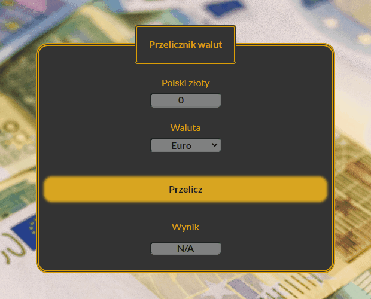

# CurrencyConverter

## Description

My first document with *input* command.
It's simply currency converter letting convert PLN value to Euro value with the constant rate defined inside the document.

## Link

Please find demo in the link below.

[Demo](https://marti2929.github.io/CurrencyConverter/)

### Technologies
- BEM
- FlexBox
- ES6+ features
